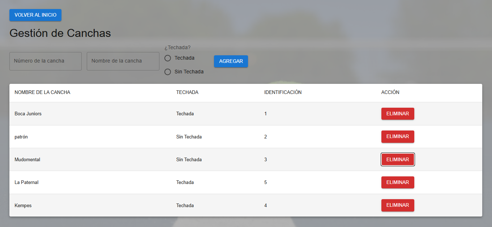
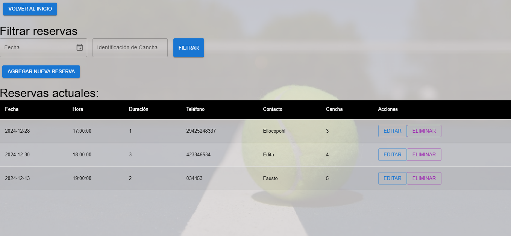
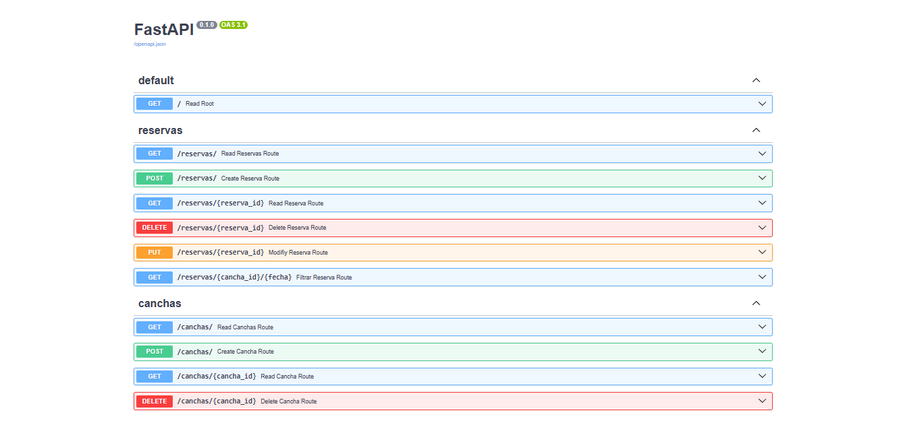

## Frontend - Instrucciones de inicio

---

## 📸 Vista previa




---

### Requisitos previos

- Tener instalado [Node.js](https://nodejs.org/) (recomendado v16 o superior)
- Tener instalado npm (se instala junto con Node.js)

### Instalación y ejecución

1. **Abrir una terminal** y navegar a la carpeta del frontend:
   ```sh
   cd frontend
   ```

2. **Instalar las dependencias** del proyecto:
   ```sh
   npm install
   ```

3. **Iniciar la aplicación** en modo desarrollo:
   ```sh
   npm run dev
   ```

4. **Abrir el navegador** y acceder a la URL que aparece en la terminal (por defecto suele ser [http://localhost:5173](http://localhost:5173)).

### Uso de la pantalla de canchas

- Puedes **agregar una cancha** completando los campos y presionando "Agregar".
- Puedes **eliminar una cancha** presionando el botón "Eliminar" correspondiente.
- Si ocurre algún error o acción exitosa, verás un mensaje en la parte inferior de la pantalla.

### Notas

- Asegúrate de que el backend esté corriendo antes de iniciar el frontend.
- El frontend se comunica con el backend a través de la API configurada en `src/services/api.js`.


## Backend - Instrucciones de inicio

---



---

### Requisitos previos

- Tener instalado [Python 3.9+](https://www.python.org/)
- Tener instalado `pip` (gestor de paquetes de Python)
- Tener una base de datos PostgreSQL configurada y accesible (puedes usar SQLite si tu código lo permite, revisa la configuración en `backend/app/core/config.py` o el archivo correspondiente).

### Instalación y ejecución

1. **Abrir una terminal** y navegar a la carpeta del backend:
   ```sh
   cd backend
   ```

2. **Instalar las dependencias** del proyecto:
   ```sh
   pip install -r requirements.txt
   ```

3. **Configurar la base de datos**  
   Asegúrate de que la URL de la base de datos esté correctamente configurada en el archivo de configuración del backend (por ejemplo, en `app/core/config.py` o `.env`).

4. **Iniciar el servidor**  
   Puedes iniciar el backend de dos maneras:

   - **Usando Uvicorn desde la terminal**:
     ```sh
     uvicorn main:app --reload
     ```
     (Asegúrate de estar en la carpeta donde está el archivo `main.py`)

   - **Usando Python directamente** (si tu `main.py` tiene el bloque adecuado):
     ```sh
     python main.py
     ```

5. **Acceder a la API**  
   El backend estará disponible en [http://localhost:8000](http://localhost:8000).

   Puedes ver la documentación interactiva de la API en [http://localhost:8000/docs](http://localhost:8000/docs).

### Notas

- El backend debe estar corriendo antes de iniciar el frontend para que la comunicación funcione correctamente.
- Si necesitas crear las tablas en la base de datos, asegúrate de que el backend ejecute la migración o cree las tablas automáticamente al iniciar (revisa el código de inicialización).